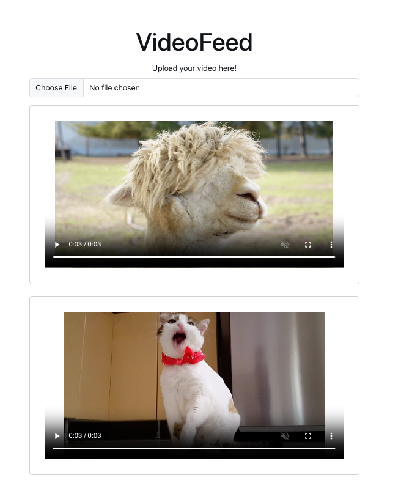

# VideoFeed Application

This is a React application that allows users to upload and view videos. The videos are stored in Supabase Storage and displayed in a video feed.

<p align="center">
  
</p>


## Features

- Upload videos in MP4 format
- Display a list of uploaded videos
- Automatically update the video feed after uploading a new video

## Technologies Used

- React
- Vite
- Bootstrap
- Supabase
- UUID

## Getting Started

### Prerequisites

- Node.js
- npm (or yarn)

### Installation

1. Clone the repository:

    ```sh
    git clone https://github.com/yourusername/videofeed.git
    ```

2. Navigate to the project directory:

    ```sh
    cd videofeed
    ```

3. Install the dependencies:

    ```sh
    npm install
    ```

### Running the Application

1. Start the development server:

    ```sh
    npm run dev
    ```

2. Open your browser and navigate to `http://localhost:3000` to see the application in action.

### Configuration

Ensure you have a Supabase project set up. Replace the `supabaseUrl` and `supabaseKey` with your own Supabase project credentials in `App.js`:

```javascript
const supabaseUrl = "https://your-supabase-url.supabase.co";
const supabaseKey = "your-supabase-key";
const CDNURL = "https://your-supabase-url.supabase.co/storage/v1/object/public/videos/";

